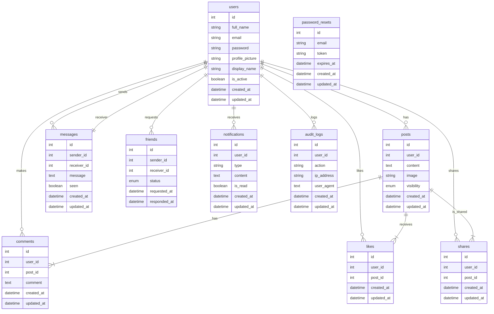

```mermaid
erDiagram

    users ||--o{ posts : has
    users ||--o{ messages : sends
    users ||--o{ comments : makes
    users ||--o{ likes : likes
    users ||--o{ shares : shares
    users ||--o{ friends : requests
    users ||--o{ notifications : receives
    users ||--o{ audit_logs : logs

    posts ||--|{ comments : has
    posts ||--|{ likes : receives
    posts ||--|{ shares : is_shared

    messages ||--|| users : "receiver"

    friends {
        int id
        int sender_id
        int receiver_id
        enum status
        datetime requested_at
        datetime responded_at
    }

    users {
        int id
        string full_name
        string email
        string password
        string profile_picture
        string display_name
        boolean is_active
        datetime created_at
        datetime updated_at
    }

    posts {
        int id
        int user_id
        text content
        string image
        enum visibility
        datetime created_at
        datetime updated_at
    }

    comments {
        int id
        int user_id
        int post_id
        text comment
        datetime created_at
        datetime updated_at
    }

    likes {
        int id
        int user_id
        int post_id
        datetime created_at
        datetime updated_at
    }

    shares {
        int id
        int user_id
        int post_id
        datetime created_at
        datetime updated_at
    }

    messages {
        int id
        int sender_id
        int receiver_id
        text message
        boolean seen
        datetime created_at
        datetime updated_at
    }

    password_resets {
        int id
        string email
        string token
        datetime expires_at
        datetime created_at
        datetime updated_at
    }

    notifications {
        int id
        int user_id
        string type
        text content
        boolean is_read
        datetime created_at
        datetime updated_at
    }

    audit_logs {
        int id
        int user_id
        string action
        string ip_address
        text user_agent
        datetime created_at
        datetime updated_at
    }
```